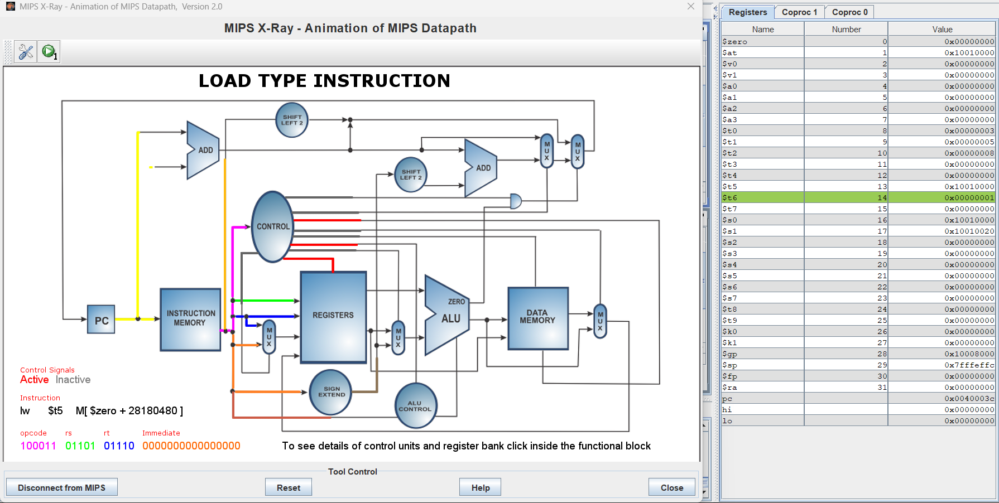
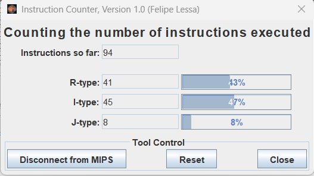
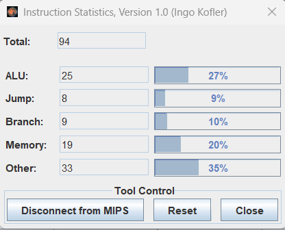
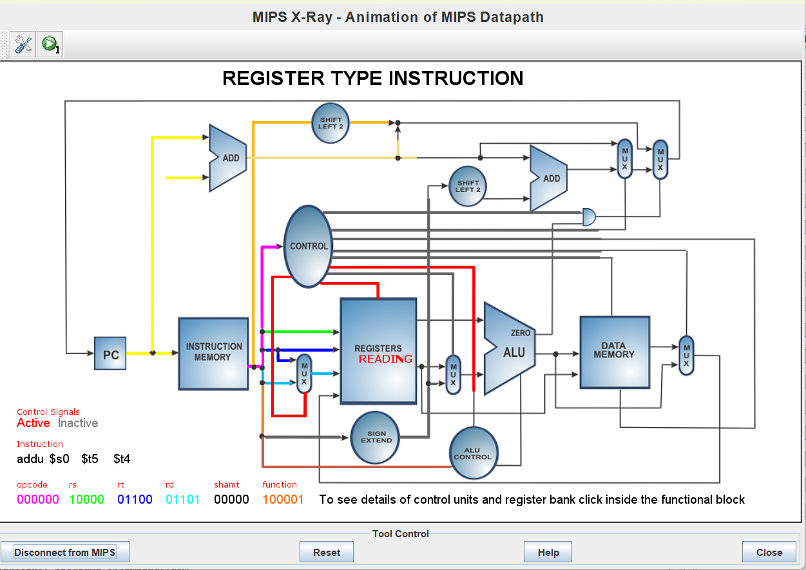
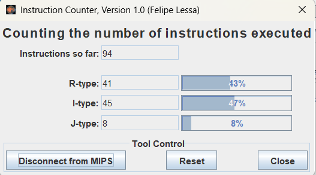
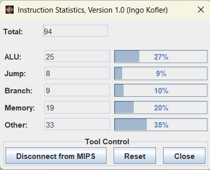

# Informe de Laboratorio: Estructura de Computadores

**Nombre del Estudiante:** Martin Camilo Suárez Rodriguez

**Fecha:** 31/08/2026

**Asignatura:** Estructura de Computadores

**Enlace del repositorio en GitHub:** [pendiente]

---

## 1. Análisis del Código Base

### 1.1. Evidencia de Ejecución

Ejecuté el `programa_base.asm` en MARS 4.5 usando las tres herramientas del menú Tools.

La primera captura es la de MIPS X-Ray, tomada justo cuando se ejecuta el `lw $t6, 0($t5)`. La herramienta la identifica como LOAD TYPE INSTRUCTION y se ve iluminado el camino completo: el PC busca la instrucción, se lee el registro `$t5`, la ALU calcula la dirección y el bloque de memoria de datos de la derecha se activa para traer el valor. Las otras dos capturas son el Instruction Counter, que marcó 94 instrucciones, y el Instruction Statistics con el desglose por tipo.



*Figura 1. MIPS X-Ray ejecutando la instrucción `lw $t6, 0($t5)` del programa base.*



*Figura 2. Instruction Counter del programa base: 94 instrucciones en total.*



*Figura 3. Instruction Statistics del programa base: desglose por tipo de instrucción.*

### 1.2. Identificación de Riesgos (Hazards)

| Instrucción Causante | Instrucción Afectada | Tipo de Riesgo | Ciclos de Parada |
|---|---|---|---|
| `lw $t6, 0($t5)` | `mul $t7, $t6, $t0` | Load-Use | 1 |
| `mul $t7, $t6, $t0` | `addu $t8, $t7, $t1` | RAW, se resuelve con forwarding | 0 |
| `sll $t4, $t3, 2` | `addu $t5, $s0, $t4` | RAW, se resuelve con forwarding | 0 |

El riesgo importante está entre el `lw` y el `mul`. El `lw` deja el valor de X[i] en `$t6`, pero ese dato solo queda disponible al final de la etapa de memoria, y el `mul`, que viene justo después, lo necesita al principio de su etapa de ejecución. Como todavía no existe, el pipeline tiene que meter un ciclo de espera. Es el caso típico de Load-Use y es el único que no se arregla solo con adelantamiento.

Las otras dos dependencias también son de lectura después de escritura, pero no cuestan nada. En esos casos el resultado ya salió de la ALU y se puede pasar directo a la instrucción siguiente por el camino de forwarding, sin esperar a que se escriba en el banco de registros.

### 1.2. Estadísticas y Análisis Teórico

| Métrica | Código Base | Código Optimizado |
|---|---|---|
| Instrucciones Totales (según MARS) | 94 | 94 |
| Stalls (Paradas) por iteración | 1 | 0 |
| Total de Stalls (8 iteraciones) | 8 | 0 |
| **Ciclos Totales Estimados** (Inst + Stalls) | 102 | 94 |
| **CPI Estimado** (Ciclos / Inst) | 1,09 | 1,00 |

MARS dio 94 instrucciones en las dos versiones, que era lo esperado: al ser un simulador funcional no modela el pipeline, así que reordenar instrucciones no cambia cuántas se ejecutan, cambia cuántos ciclos tardan.

Ese número no coincide con las líneas del archivo porque MARS expande las pseudoinstrucciones. Cada `la` se convierte en dos instrucciones reales y cada `lw` con etiqueta también. La cuenta queda en 11 instrucciones de inicialización, 80 del bucle (10 por cada una de las 8 vueltas), 1 del `beq` que sale del bucle y 2 del cierre, que suman 94.

El Instruction Statistics dio ALU 25, Jump 8, Branch 9, Memory 19 y Other 33. Los 19 accesos a memoria cuadran con las 3 lecturas de la inicialización más los 8 `lw` y los 8 `sw` del bucle. Los 9 saltos condicionales son las 8 comprobaciones del bucle más la que lo termina. Me llamó la atención que "Other" fuera tan alto, y revisando salió que MARS clasifica ahí las instrucciones `addu` y `mul`, que son justo las cuentas del bucle.

Los stalls los calculé a mano, porque MARS no los reporta. Hay un solo Load-Use por vuelta y el bucle da 8 vueltas, o sea 8 ciclos perdidos. Sumando, el código base gasta 102 ciclos para 94 instrucciones y el CPI queda en 1,09. El optimizado no pierde ninguno y se queda en 94 ciclos con un CPI de 1,00.

---

## 2. Optimización Propuesta

### 2.1. Evidencia de Ejecución (Código Optimizado)

Repetí las mismas tres herramientas con el `programa_optimizado.asm`.

En la captura de X-Ray me tocó una instrucción distinta, el `addu $t5, $s0, $t4`, que la herramienta marca como REGISTER TYPE INSTRUCTION. Sirve para comparar con la primera: aquí la ALU trabaja con dos registros y el bloque de memoria de datos se queda apagado, mientras que en el `lw` sí se encendía. Se nota que cada tipo de instrucción usa partes distintas del procesador.

El Instruction Counter y el Instruction Statistics dieron exactamente los mismos valores que en la versión base, 94 instrucciones con el mismo desglose, que es lo que confirma que no agregué ni quité nada, solo cambié el orden.



*Figura 4. MIPS X-Ray ejecutando la instrucción `addu $t5, $s0, $t4` del programa optimizado.*



*Figura 5. Instruction Counter del programa optimizado: 94 instrucciones, igual que la versión base.*



*Figura 6. Instruction Statistics del programa optimizado: mismo desglose que la versión base.*

### 2.2. Código Optimizado

```asm
loop:
    beq $t3, $t2, fin     # si i ya llego al tamano, me salgo del bucle

    sll $t4, $t3, 2       # multiplico i por 4, porque cada entero ocupa 4 bytes
    addu $t5, $s0, $t4    # obtengo la direccion de X[i]

    lw $t6, 0($t5)        # leo de memoria el valor de X[i]

    addu $t9, $s1, $t4    # OPTIMIZACION: esta linea subio aqui. Calcula la direccion
                          # de Y[i] y no depende de $t6, asi que llena el hueco del Load-Use

    mul $t7, $t6, $t0     # multiplico X[i] por A, ya sin parada
    addu $t8, $t7, $t1    # le sumo B

    sw $t8, 0($t9)        # guardo el resultado en Y[i]

    addi $t3, $t3, 1      # i = i + 1
    j loop                # vuelvo al inicio
```

### 2.2. Justificación Técnica de la Mejora

Moví la instrucción `addu $t9, $s1, $t4`, que es la que calcula la dirección donde se va a guardar Y[i]. Antes estaba después del `mul` y del `addu` del resultado; ahora la puse justo entre el `lw` y el `mul`.

Funciona porque esa instrucción no tiene nada que ver con `$t6`. Solo usa `$s1`, que es la base del vector Y, y `$t4`, que es el desplazamiento que ya se había calculado antes. Como no depende del dato que está llegando de memoria, puede ejecutarse mientras el `lw` todavía lo está trayendo.

Lo que se gana es tiempo. El hueco de un ciclo que el procesador tenía que rellenar con una burbuja ahora lo ocupa una instrucción útil, que de todas formas había que ejecutar. Cuando le llega el turno al `mul`, el valor de X[i] ya salió de la memoria y se le puede entregar por forwarding sin esperar.

El resultado del programa no cambia, porque no modifiqué ninguna operación ni ningún registro, solo el orden. Lo comprobé en el Data Segment de MARS: las dos versiones dejan en `vector_y` los valores 8, 11, 14, 17, 20, 23, 26 y 29, que son los que corresponden a Y = 3X + 5 para X de 1 a 8.

---

## 3. Comparativa de Resultados

| Métrica | Código Base | Código Optimizado | Mejora (%) |
|---|---|---|---|
| Ciclos Totales | 102 | 94 | 7,8 % |
| Stalls (Paradas) | 8 | 0 | 100 % |
| CPI | 1,09 | 1,00 | 7,8 % |

---

## 4. Conclusiones

Lo que más me quedó de esta práctica es que en bajo nivel el orden de las instrucciones importa aunque el resultado no cambie. En un lenguaje de alto nivel uno escribe las líneas en el orden que le parece más lógico y el compilador se encarga del resto; aquí, mover una sola línea de sitio quitó las 8 paradas del programa. La segmentación hace que el procesador esté trabajando en varias instrucciones a la vez, y por eso una instrucción que necesita el resultado de la anterior demasiado pronto obliga a frenar toda la cadena.

Sobre si siempre se pueden eliminar todas las paradas, creo que no. Aquí se pudo porque el bucle tenía una instrucción independiente disponible para correr de sitio. Si el código fuera una cadena donde cada instrucción necesita el resultado de la inmediatamente anterior, no habría con qué llenar el hueco y tocaría dejar la burbuja. Además hay paradas que no dependen del orden del código, como los fallos de caché o los saltos que el procesador no logra predecir. Lo realista es reducir las paradas, no eliminarlas siempre.

Otra cosa que aprendí es que contar instrucciones no sirve por sí solo para medir rendimiento. Las dos versiones ejecutan exactamente las mismas 94 instrucciones y aun así una es un 7,8 % más rápida. Lo que hay que mirar son los ciclos y el CPI.
